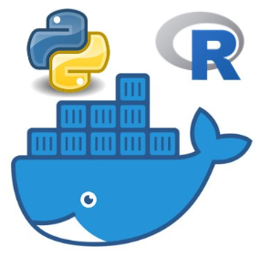

# `PockeR` 

<!-- badges: start -->
<!-- badges: end -->

Nothing related with poker game. `PockeR` is a `docker` container with bot`Python` and `R`. They can interact with `Reticulate`, either using `R` source files or `Rmarkdown` engine. 

To execute only `Python` programs, this is not the most appropriate docker container. This repository is useful when expecting `Python` and `R` to work together. This container is an extension of `rocker/verse` container that integrates `Python 3` (using anaconda) and also supports `C++` through `Rcpp`. The automatically built [Rmarkdown](https://gitlab.com/linogaliana/collaboratif/-/jobs/artifacts/master/download?job=article)

Assuming you are gitlab CI, when you need to install a new module in `Python`, you have two possibilities:

* Run shell command in `.gitlab-ci.yml`: `conda install PACKAGENAME`
* Using reticulate within `R` or `Rmd` script: `reticulate::conda_install(packages = "PACKAGENAME")`